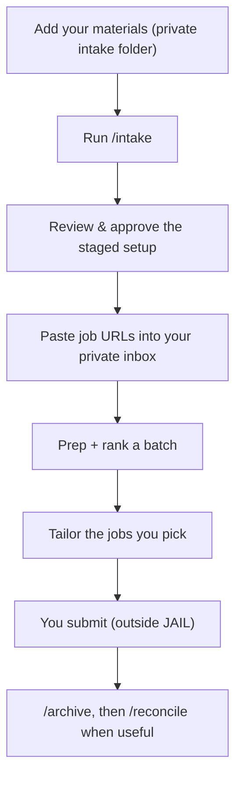

# Job Application Intelligence Layer (JAIL)

*A local, AI-assisted workflow I built during my own job search to rank roles, tailor resumes, and save your sanity — without ever sacrificing the truth.*

Applying to jobs shouldn't feel like serving time. **JAIL** helps you rank a batch of roles by how well they actually fit you, pick the strongest resume base for each, and generate a tailored draft you can finish faster. You stay in control of every word, and **it never submits anything for you.**

You run it inside **Claude Code** (Claude that can work with files on your computer). New to that? This walks you through it. Mac and Windows; plan ~20–30 minutes the first time.

---

## What you get
A ranked spreadsheet of the jobs you gave it (colored to *your* pay, location, and lane preferences), and — for the ones you pick — a **tailored resume draft plus targeting notes** (which base to start from, gaps to address, suggested bullets and summaries). It's a working draft you finish in your own editor — **not** a polished Word/Pages file.

## What it does NOT do
- It doesn't **find or scrape** jobs — you bring the links.
- It doesn't **auto-apply or submit**. Ever.
- It doesn't write **cover letters** out of the box — there's an optional module for that (run `/cover-letter-intake` to teach it your voice first; see below). Without that setup, no letters.
- It doesn't generate a **finished Word/Pages/Google-Docs resume file** — you do the final polish. (The cover-letter module is the exception: it produces a formatted `.docx` paste source.)
- It doesn't **guarantee interviews**, and it won't **invent experience** to make you look better.
- It doesn't know what you actually submitted unless you save the final file and archive it.

## The loop

---

## Quick start

1. **Get the repo** — on GitHub, **`Code` → Download ZIP** (simplest) and unzip it, or `git clone https://github.com/redheadjessica/job-application-intelligence-layer`. <!-- TODO: screenshot [shot: download-zip] -->
2. **Open it in Claude Code** — Claude desktop app → **Code** tab → **Select folder** → the unzipped folder → **Local**. Type `/` and you should see `/intake`, `/run-batch`, `/archive`, `/reconcile`. <!-- TODO: screenshot [shot: open-folder] -->
3. **Set up the Python bits (once)** — a couple of steps use small Python scripts (fetch job posts, build the spreadsheet). Just tell Claude **"Set up the Python environment for me"** and approve the installs. *(Savvy: `python3 -m venv .venv && .venv/bin/pip install -r requirements.txt`.)*
4. **Add your materials** to the two intake folders:
   - `PRIVATE__YOUR_FILES_GITIGNORED/00-INTAKE__YOUR_PRIVATE_INFO/01-about-you/` — **evidence**: resumes (any version), LinkedIn export, brag/wins docs, metrics, writing samples, and job descriptions for roles you've actually **held**.
   - `PRIVATE__YOUR_FILES_GITIGNORED/00-INTAKE__YOUR_PRIVATE_INFO/02-where-you-want-to-go/` — **direction**: postings for roles you *want*. These shape your scoring and lanes; they're never treated as proof you've done that work.
   *(You can also just paste materials into the chat.)* <!-- TODO: screenshot [shot: intake-folders] -->
5. **Run `/intake`.** It reads your materials, gives you a straight read, asks a few questions, and puts a **review folder** together — `__READY_TO_REVIEW__PRIVATE_GITIGNORED/<date> - Intake Review/`. Open `START HERE.md`, check it over, and tell Claude when it looks right. **Nothing is saved to your source-of-truth files until you approve.** <!-- TODO: screenshot [shot: intake-review] -->
6. **Add some jobs** — paste links into your private inbox `PRIVATE__YOUR_FILES_GITIGNORED/01-INBOX__YOUR_PRIVATE_INFO/paste-job-urls-to-rank-here.txt`, one per line. Then tell Claude: **"Start today's batch and tailor my top job."** *(Savvy: `python ENGINE__PUBLIC_GIT_TRACKED/03-VETTING/new_batch.py <MM-DD-YY>`, run the prep command it prints, then `/run-batch {folder: "__READY_TO_REVIEW__PRIVATE_GITIGNORED/<MM-DD-YY>", tailor: true, topN: 1}`.)*
7. **Review the results** in `__READY_TO_REVIEW__PRIVATE_GITIGNORED/<date>/`:
   - `0 - Prep Report/` — what was fetched, and anything skipped (duplicates, thin/failed posts).
   - `1 - Rankings/` — your jobs scored and sorted, with the reasons why.
   - `2 - Tailored Resumes/` — your top job's draft + notes. Start with the "Questions for the candidate" section, then finish in your own editor.
   <!-- TODO: screenshot [shot: review-hub] -->
8. **Submit outside JAIL**, save the final resume as a **PDF** in the job folder, then **`/archive`** it (moves it to your private archive). Later, **`/reconcile`** so JAIL can learn from what you actually submitted.

That's the whole loop. Re-run it whenever you've collected a few new postings.

---

## Folders (plain language)
Three top-level folders are all you ever work with:

- **`ENGINE__PUBLIC_GIT_TRACKED/`** — the public engine. All the numbered workflow stages' code, agents, prompts, and blank `*.template.*` files. Git-tracked, safe to commit, you rarely open it; update it with `git pull`.
- **`PRIVATE__YOUR_FILES_GITIGNORED/`** — your private data. The filled-in instances `/intake` generates (profile, scoring card, experience bank, cover-letter voice…), your intake materials, and your submitted-applications archive. **Gitignored — never committed.** This is where you edit.
- **`__READY_TO_REVIEW__PRIVATE_GITIGNORED/`** — your generated work to review. Ranked job batches, tailored resume drafts, cover letters, and staged intake/reconcile reviews. **Gitignored.** This is where you find output.

Inside `ENGINE__…/` and `PRIVATE__…/` the stages mirror one-to-one — `00-INTAKE`, `01-INBOX`, `02-PREP`, `03-VETTING`, `04-TAILOR` under ENGINE, and your private half under `<stage>__YOUR_PRIVATE_INFO`. Your config `jail.config.json` sits at the repo root (gitignored; `jail.config.template.json` is its tracked template). Submitted applications default into `PRIVATE__…/05-SUBMITTED-APPLICATIONS__YOUR_PRIVATE_INFO/`, or point the archive at a cloud folder in `jail.config.json`.

*(The repo root also holds tool folders — `.claude/`, `.git/`, `.venv/` — and files like this README. They're required plumbing, not something you work with.)*

## Privacy — local-first, and built for it
This matters, so read it once:
- The repo ships **tracked templates + workflow code** — never anyone's data. Those are safe to commit.
- The files intake **generates from your resume** are gitignored **instances** (your real scoring card, profile, experience bank, preferences). Your **raw intake materials** are gitignored. Your **submitted-applications archive** is gitignored.
- The **template/instance split** exists specifically to reduce accidental privacy leaks — so your private job-search data stays on your machine and out of git by default.
- If you fork the repo, **keep the fork private** unless you really know what you're doing. Don't push your generated instances or raw materials to a public repo.

(Privacy is about your *candidate data*, not the author — the project is intentionally public.)

## Where you stay in charge
JAIL speeds the work up; you keep the judgment. You review: the **intake setup** before it's saved, the **rankings** before you tailor, the **tailored draft** before you submit, the **archive** before it moves, and any **reconcile proposals** before they touch your core files. It drafts and organizes — you decide and submit.

## Commands
Mostly you just talk to Claude. The slash commands: **`/intake`** (set up / update), **`/run-batch`** (rank a batch, optionally tailor), **`/vet-jobs`** / **`/tailor-jobs`** (rank-only / tailor specific jobs), **`/cover-letter-intake`** (optional: teach the letter system your voice from your past letters), **`cover-letter`** (draft + adversarially evaluate a letter for a job), **`/archive`** (move a submitted app to your archive), **`/reconcile`** (learn from submitted apps).

## Good to know
- **It hands you a draft, not a final.** You finish the wording/formatting in your own editor.
- **It's honest with you.** Intake tells you straight where your resume is weak — that's the point.
- **It's an early, local workflow** — review its outputs before relying on them. Builder-level caveats and what still needs a live test are in [`docs/testing-and-caveats.md`](docs/testing-and-caveats.md).
- **Mind how it's billed.** Depending on your Claude Code setup it runs on your Claude subscription or API credits — worth checking which before a big batch.

## Deeper docs
- [`docs/v2-end-to-end-workflow.md`](docs/v2-end-to-end-workflow.md) — the full workflow + architecture (source of truth).
- [`docs/final-review-and-cover-letters.md`](docs/final-review-and-cover-letters.md) — the final mile, and how the optional cover-letter module fits.
- [`ENGINE__PUBLIC_GIT_TRACKED/04-TAILOR/cover-letter/README.md`](ENGINE__PUBLIC_GIT_TRACKED/04-TAILOR/cover-letter/README.md) — the cover-letter system (your voice spec, deterministic lint, adversarial eval, anti-smoothing).
- [`docs/testing-and-caveats.md`](docs/testing-and-caveats.md) — what's verified vs. still needs a live run.

## If `/intake` doesn't show up
Make sure you opened the **folder itself** (the one with this README), chose **Local**, and typed `/` to refresh. Still stuck? Tell Claude "I don't see the intake skill" and it'll check the setup with you.

---

## About
Built by **Jessica Barnett**, a product leader and builder exploring practical AI workflows for job search, personal systems, and product work. No guarantees, no magic, no auto-applying — a real tool I built (with AI) during my own search and decided to share.

**Feedback or suggestions?** [linkedin.com/in/redheadjessica](https://www.linkedin.com/in/redheadjessica/)
