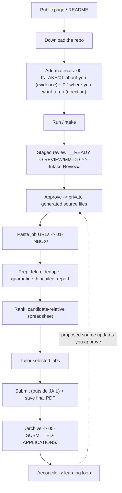

# JAIL V2 — End-to-End Workflow (source of truth)

> Status: living doc. Accuracy over polish. This is the reference for the V2 user journey and
> architecture. Copy/UX wording gets refined in later units; the structure here is what we build toward.

## Implementation status

- **Done (V2A · Unit 1 — rename + template/instance split):** numbered folder architecture; `.template.md` / `.template.json` (tracked) vs generated instance files (gitignored); all path references updated; `__READY TO REVIEW` date-shape batch guard; this doc.
- **Done (V2A · Unit 2 — intake source-of-truth lifecycle):** `/intake` rewritten for template → staged review → approval → promotion; first-run vs update mode; materials inventory (families + statuses); basic application lanes (profile + `jail.config` mirror); `jail.config.json` population; `<!-- jail-approved: -->` marker; intake now generates the `05-summary-quick.md` / `06-skills-quick.md` quick-references (fixes the tailoring gap) and a narrow `03-approved-truths-and-boundary-rules.md` instance; tracked review-file skeletons under `.claude/skills/intake/review-templates/`.
- **Done (V2A · Unit 3 — de-personalize the tailoring brain):** `04-TAILOR/00-job_application_agent.md` and `.claude/agents/job-applier.md` generalized to be role-/candidate-agnostic (PM/health/founder/current-venture/Jessica-specific assumptions removed; stale `00 - Ready To Apply` Step 0 replaced with the batch-folder reality; cover-letter detail trimmed to an out-of-scope pointer); `03-approved-truths-and-boundary-rules.template.md` rewritten to the narrow boundaries-only structure; SKILL.md `03` step now points at that template (interim divergence closed); `05`/`06` template headers aligned to the template→instance wording.
- **Done (V2B · Unit 4 — prep reliability):** shared `02-PREP/prep_common.py` (URL normalization/dedupe, collision-safe filenames, thin/failed classification, manifest + report, quarantine layout); both fetchers delegate to it; exact + normalized URL dedupe; same company/title soft-flag; thin/failed quarantined into `3 - Source Material/Needs Review/` and `Failed/` (ranking reads only `All Job Posts (full text)/`); `0 - Prep Report/prep-manifest.json` + `prep-report.md`; manifest-aware re-run = retry (`--force` to refetch all); `new_batch.py` scaffolds the new folders + prints one primary prep command.
- **Done (V2B · Unit 5 — candidate-relative ranking):** `vet-jobs` loads `jail.config.json` and inlines it as `<preferences>` to sharpen `practicality_score`, and adds a `lane_fit` schema; `make_rankings_xlsx.py` reads the config and colors **Comp Fit** (vs target/floor, top-of-range) and **Location Fit** (vs the candidate's per-arrangement ratings) candidate-relative, adds **Comp Fit / Location Fit / Lane Fit** columns, aligns `final_score` color to the Status bands, falls back to neutral + a note when config is missing, and shows a prep-quarantine note; intake now captures `arrangements` ratings + `home_metro_aliases`; `jail.config.template.json` pins the `preferred/ok/stretch/no/null` vocabulary.
- **Done (V2C · Unit 6 — archive + reconcile UX):** new `/archive` skill (interactive, move-not-copy, readiness check, missing/ambiguous final-PDF warning, config-aware archive path + year subfolder, `archive-summary.md`, workspace-leftover mention); `reconcile.js` made config-aware (resolves `archive.path` from `jail.config.json`, fallback `05-SUBMITTED-APPLICATIONS`, scans year subfolders), now appends finalized summaries → `05a` and skills observations → `06a` (create-from-template if missing; primary files 01–06 still gated via the queue), warns about completed-looking folders left in `__READY TO REVIEW`, and carries cadence guidance.
- **Done (V2C · Unit 7 — docs + public-page copy + onboarding):** README refreshed to V2 (tool-first quick-start, privacy/template-instance section, folder map, commands, a Mermaid loop); new docs — `jail-public-page-copy.md` (website handoff), `user-message-copy.md` (voice deck), `final-review-and-cover-letters.md`, `testing-and-caveats.md`, `screenshots-plan.md` (synthetic "Jordan Lee" persona); this doc gets the full diagram + companion-docs map. No code changes.
- **Carried live caveats (need the Python venv):** Unit 4 live network fetch, Unit 5 live xlsx render, and Unit 6 live `/archive` + `/reconcile` still need a real-dependency sanity test — tracked in `testing-and-caveats.md`.

---

## Companion docs
- `../README.md` — beginner/user onboarding (tool-first).
- `jail-public-page-copy.md` — suggested copy for the external `redheadjessica.com/jail` page (handoff; the website source is in another repo).
- `user-message-copy.md` — the canonical chat voice for each step.
- `final-review-and-cover-letters.md` — what V2 leaves to the user.
- `testing-and-caveats.md` — what's verified offline vs. still needs a live run.
- `screenshots-plan.md` — synthetic-persona screenshot checklist.

## 1. North star

JAIL is not just a repo of scripts — it should feel like a **guided local product** for non-engineers. The journey starts on the public page, then moves between GitHub, Claude Code, local folders, Markdown review files, spreadsheets, and chat.

## 2. Core principles

- **Chat is the control surface.** Files are durable context and review artifacts. The system always tells the user what happened, where to look, what to review, and what to do next.
- **Truth is part of the product.** Help the candidate sound stronger and more strategic, but never inflate, invent, blur, or keep repeating a bad inference after the user corrects it.
- **One thing lives in one place.** Completed application folders are **moved** to the archive, not copied into duplicate locations.
- **Templates are safe to commit; your filled files are not.** Tracked `*.template.*` files are blank/synthetic; `/intake` writes your personal data into gitignored instance files. The engine reads instances; if one is missing it says "run `/intake` first" instead of failing mysteriously.

## 3. In scope for V2

- **V2A — Rename, intake, truth, source architecture:** numbered folders; about-you vs where-you-want-to-go split; renamed job-URL inbox; default archive; path updates; preserve `__READY TO REVIEW`; protect batch parsing; this doc; prepare intake staging/approval; prepare `materials-inventory.md`; prepare `jail.config.json`; prepare lane taxonomy; rename/refactor `03` into approved-truths-and-boundary-rules; de-personalize the tailoring brain; ensure intake populates `05`/`06`.
- **V2B — Batch reliability + ranking quality:** dedupe exact/normalized URLs; soft-flag company/title dupes; collision-safe filenames; retry thin/failed non-ATS fetches; quarantine failed/thin posts; prep manifest/report; prep results in chat; candidate-relative comp + location coloring; lane-aware ranking; better ranking review copy.
- **V2C — Archive, reconcile, docs, public page:** configure archive location; default in-repo gitignored archive; move (not copy) completed folders; check reconcile readiness; warn if final PDF missing; manual reconcile with cadence guidance; warn about finalized folders still in `__READY TO REVIEW`; README + public-page copy; synthetic screenshots; workflow diagram; user-facing messages; explain optional human/model review; explain cover letters are out of scope.

## 4. Out of scope for V2

Job sourcing/scouting; LLM/web-search/API sourcing (Adzuna/JSearch/etc.); auto-applying; submitting; finished Word/Pages/Google-Docs resume rendering; full resume creation from scratch as a feature; cover-letter generation in the agent; ChatGPT-specific review packets/flows; hosted product behavior; automatic hard-gating of dealbreakers; designing the primary flow around setting this up for a friend; a full UI/web app.

**Future roadmap:** V3 resume creation/rendering · V4 optional API-backed sourcing · later/maybe cover letters, formatted export, Google Sheets export, hosted version, stronger application-answer generation.

---

## 5. End-to-end workflow (steps 0–18)

0. **Arrive at the public JAIL page** (`redheadjessica.com/jail`, separate from this repo). It explains what JAIL is, who it's for, what it does/doesn't do, that it's local, uses Claude Code, that truth is part of the product, that the user stays in control, that it's not a hosted web app, and that the user moves between chat and local files.
1. **Get the repo** — clone, or Download ZIP → unzip → open the folder in Claude Code → run `/intake`.
2. **Setup/orientation in Claude Code** — chat is the control surface; files are durable context; `__READY TO REVIEW` holds things needing human eyes; `00-INTAKE` holds career/direction materials; `01-INBOX` holds active job URLs; editing files doesn't trigger work unless you tell Claude; nothing submits applications. *When in doubt, tell Claude in chat what you added/changed/approved or want to do next.*
3. **Gather intake materials** into `00-INTAKE/01-about-you/` (evidence) and `00-INTAKE/02-where-you-want-to-go/` (direction). See §7.
4. **Run `/intake`** — reads materials, saves durable pasted facts when relevant, updates a materials inventory, asks clarifying questions, separates facts from direction. Supports first-run and (later) update behavior from one command.
5. **Define application lanes** — one or several. Becomes a shared taxonomy across intake, vetting, resume index, tailoring, reconcile. See §8.
6. **Staged intake review** — Claude writes proposals into `__READY TO REVIEW/MM-DD-YY - Intake Review/` (with `START HERE.md` and numbered review files), not directly into canonical files, and summarizes in chat.
7. **User reviews and corrects** — paste/voice feedback in chat, or edit staged files directly (Claude rereads before promoting). Silence is never approval. The explicit truth gate: *"Accurate enough to start ranking jobs, or do you want to add/correct anything first?"*
8. **Promote approved source of truth** — on approval, Claude writes the durable instance files (scoring card, candidate profile, `jail.config.json`, profile, resume index, approved truths & boundary rules, experience bank, summary quick, skills quick, materials inventory) and marks them approved. No required generation file remains placeholder-filled.
9. **Add jobs to rank** — paste URLs into `01-INBOX/paste-job-urls-to-rank-here.txt`, or paste in chat (Claude saves them; they don't stay thread-only).
10. **Prep fetches job posts** — dedupe exact + normalized URLs, soft-flag company/title dupes, avoid filename collisions, fetch full text, retry thin/failed non-ATS posts, quarantine failed/thin posts so they aren't ranked, write a prep manifest, return a prep summary in chat. A `0 - Prep Report/` folder appears when useful.
11. **Rank jobs** — into `__READY TO REVIEW/MM-DD-YY/` with `START HERE.md`, `0 - Prep Report/`, `1 - Rankings/`, `3 - Source Material/`. Rankings include status, category, company, title/link, location, comp, matched lane, the four sub-scores, final score, top reasons, top concerns. Coloring is **candidate-relative** (location vs the user's stated preference, comp vs floor/target, scores vs rubric — no hardcoded "remote is always green").
12. **User chooses jobs to tailor** — selected, top N, one at a time, or a manual set.
13. **Tailor selected jobs** — into `__READY TO REVIEW/MM-DD-YY/2 - Tailored Resumes/Company - Role/`, each with the original job post, the application-resume-output Markdown, recommended base, questions for the candidate, risks/truth checks, tailoring notes.
14. **Final review outside JAIL** — the user's judgment, plus optionally another AI assistant or a trusted human. Optional, **not productized** in V2 (no special packets, no ChatGPT-specific flow, no cover-letter generation).
15. **Submit externally** — JAIL never submits. After submitting, export/save the final submitted resume as **PDF** (and any cover letter / application answers).
16. **Move completed folder to archive** — after submission, **move** (not copy) the job folder into the archive (default `05-SUBMITTED-APPLICATIONS/<year>/`, configurable). `__READY TO REVIEW` is a workspace, not the long-term record; don't delete a batch before archiving its completed applications.
17. **Run reconcile manually** — intentionally, after applications are submitted and archived. Early cadence: frequently (every few applications). Later: after a batch, after using a new lane/base, or when the final version differed meaningfully from the agent draft. Reconcile compares agent recommendation vs final submitted resume vs job post (+ optional cover letter/answers) and writes reconcile reports, learning-ledger updates, and source-update-queue items. It never silently edits canonical files.
18. **Source updates improve future runs** — reconcile may reveal a base to promote, a lane needing different emphasis, a summary that keeps getting rewritten, a skill that's too strong/weak, a boundary rule to add, or a ranking preference that's off. These go through human review before becoming canonical.

**The loop:** source materials → intake → approved source of truth → rank jobs → tailor selected jobs → submit → move to archive → reconcile → approve source updates → better future rankings and resumes.

---

## Workflow diagram



## 6. Target folder structure

```text
jail.config.template.json        (tracked)   jail.config.json  (gitignored instance)

00-INTAKE/
  README.md
  01-about-you/        (evidence; gitignored except README/.gitkeep)
  02-where-you-want-to-go/  (direction; gitignored except README/.gitkeep)
  materials-inventory.template.md   →  materials-inventory.md  (instance)
  resume-assessment.md              (instance, no template)

01-INBOX/
  paste-job-urls-to-rank-here.txt   (tracked seed)

02-PREP/                 prep_job_urls.py · prep_job_urls_playwright.py · ats_fetchers.py

03-VETTING/
  CLAUDE.md · new_batch.py · make_rankings_xlsx.py
  01-scoring-card.template.md       →  01-scoring-card.md       (instance)
  02-candidate-profile.template.md  →  02-candidate-profile.md  (instance)

04-TAILOR/
  00-job_application_agent.md       (engine)
  06c-skills-reconciliation-rules.md (engine)
  01-profile.template.md            →  01-profile.md            (instance)
  02-resume-index.template.md       →  02-resume-index.md       (instance)
  03-approved-truths-and-boundary-rules.template.md  →  (instance)
  04-experience-bank.template.md    →  04-experience-bank.md    (instance)
  05-summary-quick.template.md      →  05-summary-quick.md      (instance)
  05a-summary-library.template.md   →  (instance)
  06-skills-quick.template.md       →  06-skills-quick.md       (instance)
  06a-skills-library.template.md    →  (instance)
  10-bio-library.template.md        →  (instance)
  learning/
    reconcile-spec.md               (engine)
    learning-ledger.template.md     →  learning-ledger.md       (instance)
    source-update-queue.template.md →  source-update-queue.md   (instance)

05-SUBMITTED-APPLICATIONS/   (gitignored archive; default; year subfolders created lazily)

__READY TO REVIEW/   (review hub: MM-DD-YY job batches + "MM-DD-YY - Intake Review", etc.)

docs/   (this doc and future diagrams/screenshots)
```

## 7. Intake materials: about-you vs where-you-want-to-go (the truth firewall)

- **`01-about-you` = evidence** about the candidate: resumes (all versions), LinkedIn export, brag/wins, reviews, metrics, project/launch docs, writing samples, and **job descriptions for roles they actually held**.
- **`02-where-you-want-to-go` = direction:** target/dream roles, reaching-for roles, "more of this / less of this," title/industry/company-type/workstyle/comp/location preferences.
- **The firewall:** a job description counts as *evidence about your experience* **only if you held that role.** Every other JD is *direction only* — it shapes scoring and lanes, never claims. Wanting a role does not put its requirements on your resume. When a JD's classification is unclear, intake **asks** before using it.

## 8. Application lanes

Users may target one lane or several (e.g. "Senior IC Product / Product leadership / AI product / Health tech" or "FP&A leadership / Strategic finance / BizOps"). Lanes become **one shared taxonomy** used by intake, vetting, the resume index, tailoring, and reconcile. Each lane eventually carries: name, priority/rank, what fits, what doesn't fit, target titles, target industries/company-types, preferred resume base, summary/skills emphasis, and tradeoff notes. (Lane *behavior* is built in a later unit; intake infers lanes and asks for confirmation rather than cold-labeling.)

## 9. Approved truths & boundary rules (`04-TAILOR/03-approved-truths-and-boundary-rules.md`)

Stores the important truth rules: what's safe to say, what needs evidence, and what the model must not overstate, imply, invent, or keep repeating after the user corrects it. It is **not** a full profile, skills list, metrics list, summary bank, or experience bank. It's specifically for recurring friction points where the model naturally tries to make the candidate sound stronger but crosses a line. Examples that belong: "Don't imply this startup has meaningful traction; it has two users." "Don't say I managed a team; I led cross-functional work but wasn't a people manager." "Don't describe this as enterprise sales experience." "This metric is directional, not verified." Examples that don't belong: every skill, every metric, every summary, complete role histories, general resume strategy.

How boundaries split: **global** career-wide boundaries live in `01-profile.md`; **per-pinned-entity** wording + boundaries live in `03`; **per-role** "may use / do not claim" guidance lives in the experience bank role blocks. Additive, stricter-wins; cross-link, don't restate. *(The current `03` file still reflects the older current-work-canonical structure — see its migration banner — and gets re-scoped in the de-personalization unit.)*

## 10. Repeated `/intake` runs

- **First run vs update from one command.** First run: "Looks like this is your first intake. I'll help you set up your source of truth." Later: "Looks like you already have an approved intake. I'll check for new or changed materials and help you update." No separate `/intake update` command unless there's a strong technical reason.
- **Don't delete old materials by default.** New runs add/update; they don't discard prior inputs.
- **Materials inventory tracks state** per material: `pending` / `ingested` / `superseded` / `excluded` / `needs-review`, with families `about-you` / `held-role-jd` / `where-you-want-to-go` / `voice` / `unclear`. Pasted facts get saved durably (not thread-only).

## 11. Archive & reconcile

- **Move, don't copy.** After submission the completed folder moves to the archive; one record, one place.
- **Reconcile is manual**, run intentionally after submission + archiving (cadence in step 17).
- **Required files before a folder is reconcile-ready:** the original `application_resume_output - … .md`, the **final submitted resume PDF** (a `.pages`/`.docx` alone is not enough), and the scraped job post; cover letter / application answers are optional. Warn loudly if the final PDF is missing.
- **Default archive:** in-repo, gitignored `05-SUBMITTED-APPLICATIONS/<year>/`, configurable via `jail.config.json` (point it at a cloud-synced folder for durability if you prefer).

---

## 12. V2 build units

1. **Rename + template/instance split** (done) — folder/file architecture, tracked templates, gitignored instances, path updates, batch-parse guard, this doc.
2. **Intake source-of-truth lifecycle** (done) — `/intake` template → staged review → approval → promotion; first-run vs update; materials inventory; basic application lanes (one shared taxonomy seeded in the profile + `jail.config` mirror); `jail.config` population; approval marker; generates `05`/`06` quick-references (fixes the tailoring gap) + a narrow `03` instance; review-file skeletons.
3. **De-personalize the tailoring brain** (done) — `00-job_application_agent.md` + `job-applier.md` made role-agnostic (PM/health/founder/current-venture/person-specific assumptions removed); `03` *template* re-scoped to the narrow boundaries-only structure; SKILL.md `03` step + `05`/`06` headers aligned.
4. **Prep reliability** (done) — `prep_common.py`; exact+normalized URL dedupe; company/title soft-flag; collision-safe filenames; thin/failed classification + quarantine (`Needs Review/`, `Failed/`); `prep-manifest.json` + `prep-report.md`; manifest-aware retry; ranking reads usable-only.
5. **Candidate-relative ranking** (done) — `vet-jobs` inlines `jail.config.json` (sharper `practicality_score`) + `lane_fit`; colorizer reads config → candidate-relative Comp Fit / Location Fit + Lane Fit columns, status-aligned `final_score`, neutral fallback + quarantine note; intake captures arrangement ratings.
6. **Archive + reconcile UX** (done) — `/archive` skill (move-not-copy, readiness, PDF warning, `archive-summary.md`); config-aware reconcile (jail.config archive path + year scan), `05a`/`06a` appends (primary files still gated), workspace-leftover warning, cadence.
7. **Docs + public page** (done) — README refresh; `jail-public-page-copy.md`, `user-message-copy.md`, `final-review-and-cover-letters.md`, `testing-and-caveats.md`, `screenshots-plan.md`; Mermaid diagrams; companion-docs map.

## 13. Future roadmap

V3: resume creation & rendering improvements. V4: optional API-backed job sourcing. Later/maybe: cover letters, final formatted resume export, Google Sheets export, hosted version, stronger application-answer generation.
